

# Bezpieczeństwo aplikacji Web. Projekt zaliczeniowy. Michał Kaszubowski 275019

## Architektura aplikacji

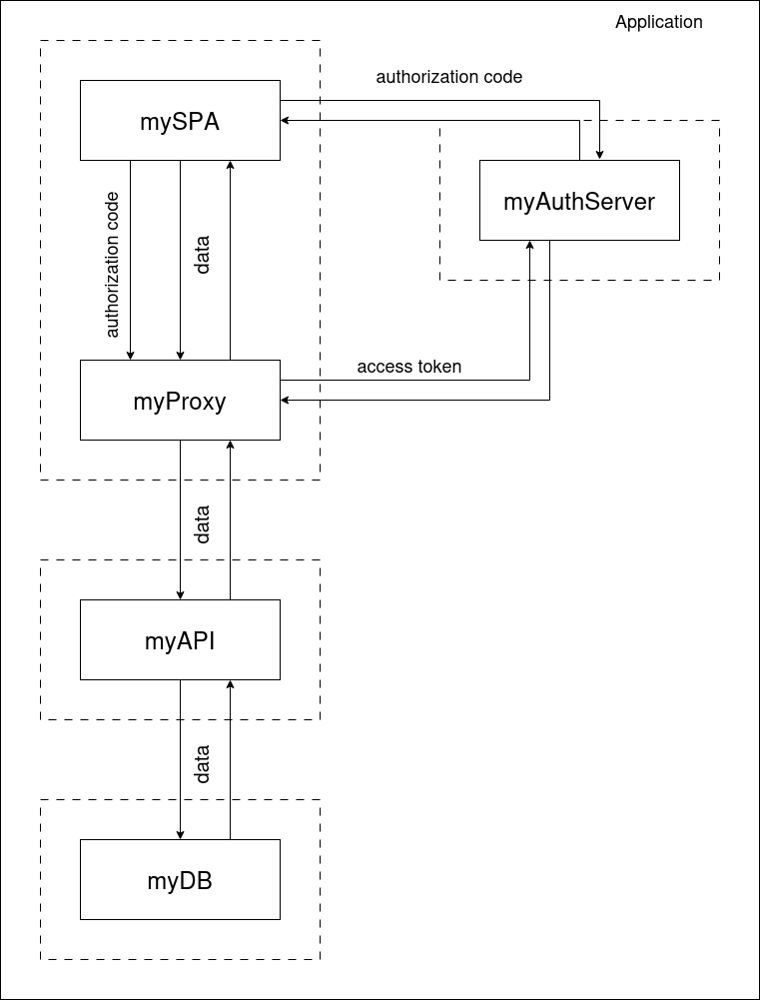 

## 1. mySPA

Frontendowy User Interface. 

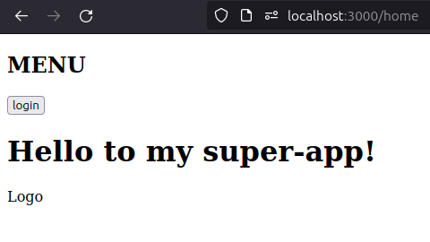
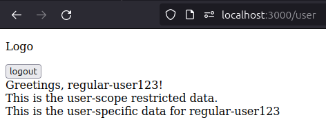
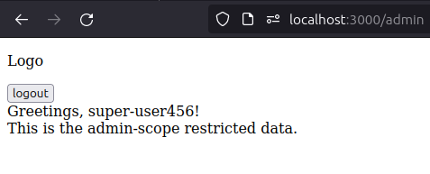 

## 2. myAuthServer

Serwer Keycloak serwowany lokalnie w kontenerze. 
`docker run -p 8080:8080 -e KEYCLOAK_ADMIN=admin -e KEYCLOAK_ADMIN_PASSWORD=admin quay.io/keycloak/keycloak:21.1.1 start-dev
` 

Konfiguracja:

* realm: `myrealm`
* clients: `wsx2375` (random id)
  * client flow: `authorization code flow`
* redirects:
  * `http://localhost:3000/oauth/intercept`
* web origins:
  * `http://localhost:3000`
* client secret: `mkDaSyQLBWgCbZoVJG97heFC3s6yxb3S`
* realm roles:
  * admin
  * user
  * offline_access
  * default-roles-myrealm
  * uma_authorization
* users:
  * regular-user123 password: `secret` roles: `user`
  * super-user456 password: `secret` roles: `admin`
  * możliwość samorejestracji przez użytkownika z automatycznie przypisywaną rolą `user`

</ul>
 

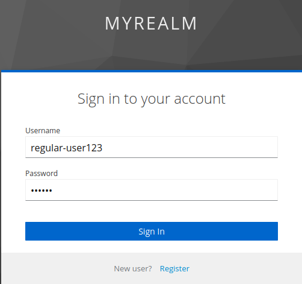
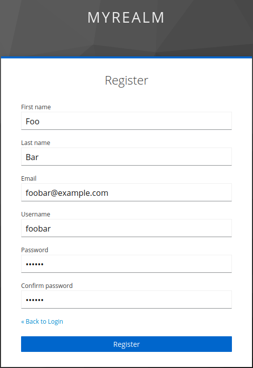
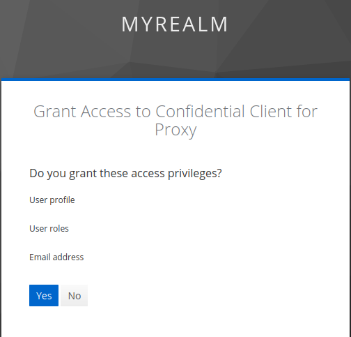
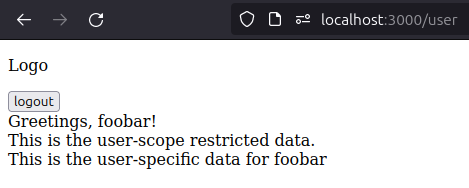 

## 3. myProxy

Zaufany pośrednik mySPA, który przechowuje w sobie bezpiecznie tokeny. Nie da się ich wykraść, ponieważ są niewidoczne dla mySPA. 
Proxy otrzymuje kod autoryzacyjny z logowania przez pośrednictwo mySPA, a następnie sam uzyskuje token i dba o jego odświeżanie (refresh_token). Przekazuje również requesty do myAPI opatrzając je w konieczny do zweryfikowania ich wiarygodności token. 

Lista dostępnych endpointów dla myProxy: 

<ul>
    <li>/ [GET, POST] wyświetla tą listę. Pozwala na testowanie requestów</li>
    <li>
        
/oauth

        <ul>
            <li>/ [GET] sprawdza połączenie z serwerem Keycloak</li>
            <li>/init?code={authorization_code_here} [GET] służy do rozpoczęcia flow i zdobycia tokenu</li>
            <li>/userinfo [GET] zwraca informacje o zalogowanym użytkowniku</li>
            <li>/end [GET] wylogowuje zalogowanrgo użytkownika. Kończy sesję. Nie usuwa danych zapisanych w sobie, bo te i tak tracą ważność po wylogowaniu w Keycloak'u</li>
        </ul>
    </li>
    <li>/forward?request={userpublic || userprivate || adminpublic} sprawdza, czy token nie stracił ważności. Wymienia go na nowy, jeśli zajdzie taka potrzeba i przekazuje request do myAPI</li>
</ul>

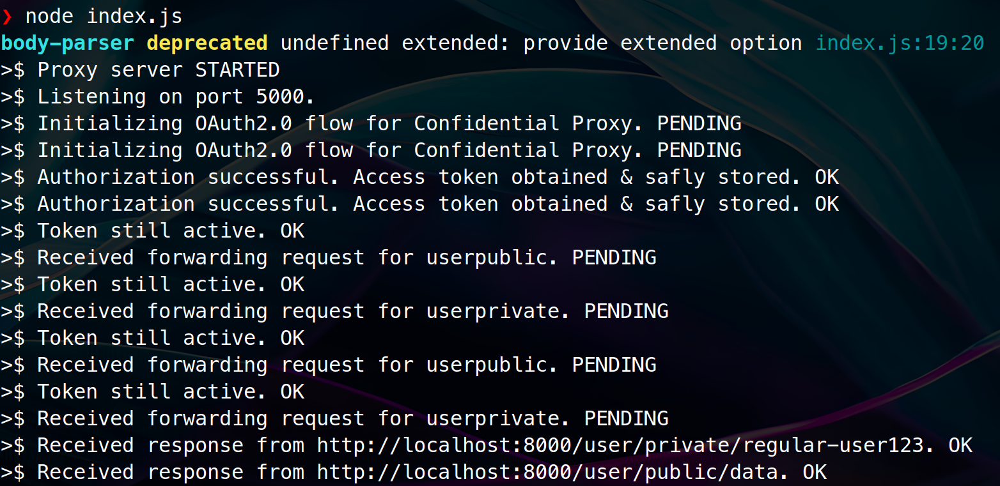 

## 4. myAPI

API odbierające requesty dostępu do danych. Jest skonfigurowane, aby używać bazy danych MongoDB i sprawdzać, czy może udzielić odpowiednich danych przez weryfikację tokenu oraz zdefiniowanej w nim roli użytkownika. W połączeniu z bezpiecznie przechowywanym tokenem daje to pewność, że request wykonuje obecnie zalogowany użytkownik i nie otrzyma niestosownych dla siebie danych. 

Lista dostępnych endpointów dla myAPI: 
<ul>
    <li>/ [GET, POST] wyświetla tą listę; pozwala na testy zapytań.</li>
    <li>
        
/check

        <ul>
            <li>/user [GET] sprawdza, czy jest dostęp do danych user'a</li>
            <li>/admin [GET] sprawdza, czy jest dostęp do danych admina</li>
        </ul>
    </li>
    <li>
        
/user

        <ul>
            <li>/public/data [GET] zwraca dane dla wspólne dla wszystkich zalogowanych użytkowników</li>
            <li>/private/:userID [GET] zwraca dane specyficzne dla użytkownika</li>
        </ul>
    </li>
    <li>
        
/admin

        <ul>
            <li>/public/data [GET] zwraca dane, do których mają dostęp wszyscy admini</li>
        </ul>
    </li>
</ul>

### Funkcjonalność myAPI jest oczywiście przykładowa i służy jedynie pokazaniu, że flow działa. Serwowane przez nie dane nie są specjalnie przydatne

 

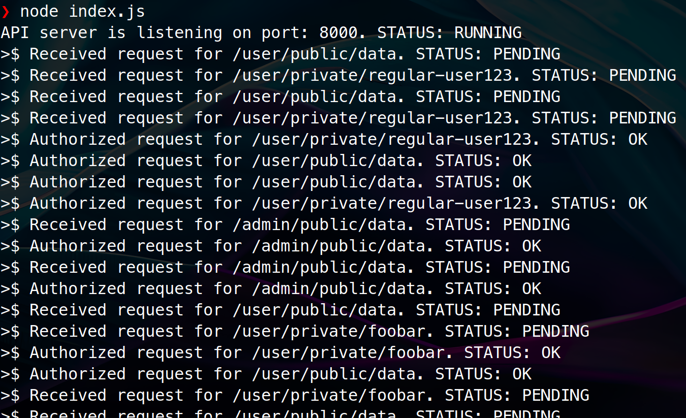 

## 5. myDB

Lokalnie hostowany kontener mongodb konieczny do działania łączącego się z nim myAPI: 
`docker run -p 27017:27017 mongo` 

## Uwaga odnośnie instalacji frontendu

Po instalacji pakietów `/node_modules` dla mySPA, konieczne jest wywołanie skryptu `./cheatReact.sh` z katalogu głównego SPA, który podmieni plik konfiguracyjny na taki z fallback'ami. Było to niestety konieczne ze względu na brak ich automatycznego wspierania przez nowsze wersje React.js! 

# Efekt końcowy

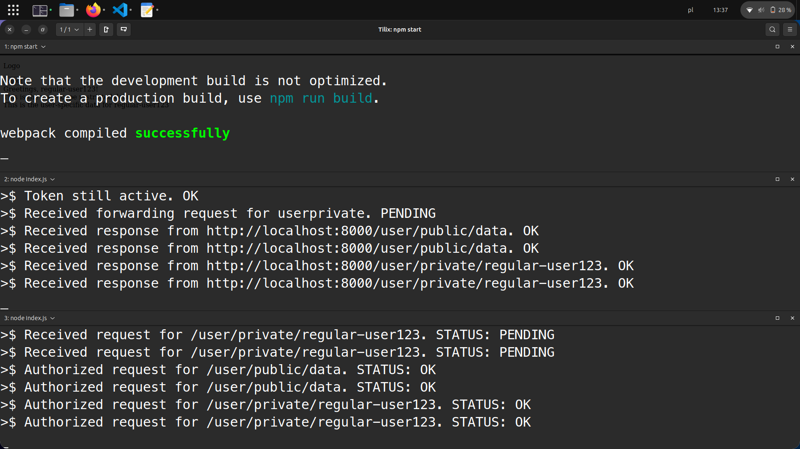 
Pierwsze okno konsoli: `cd frontend && npm start` 
Drugie: `cd proxy && node index.js` 
Trzecie: `cd api && node index.js` 
W tle: działający React App. 

Polecenia wykonywane od końca po wcześniejszym uruchomieniu obrazów mongo i keycloak: 

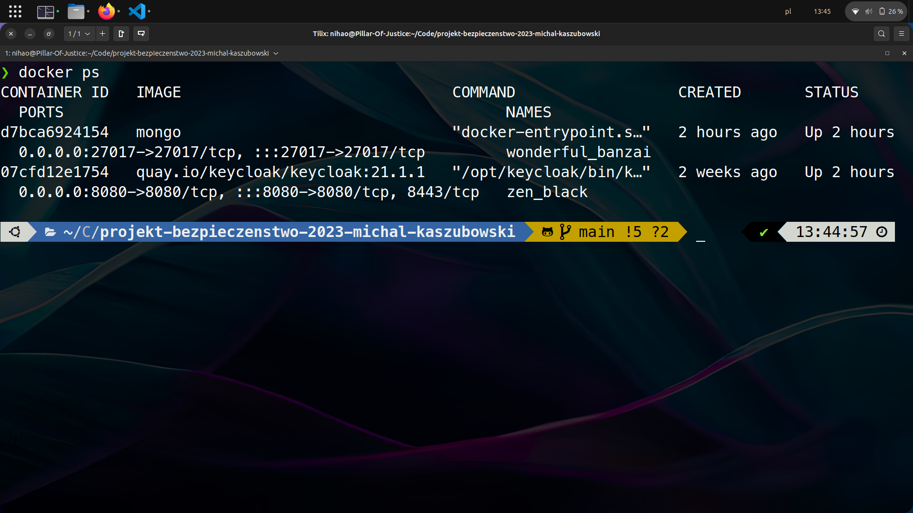 
